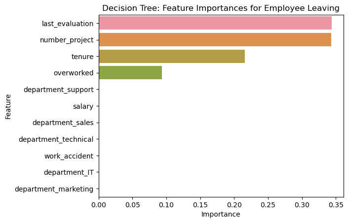
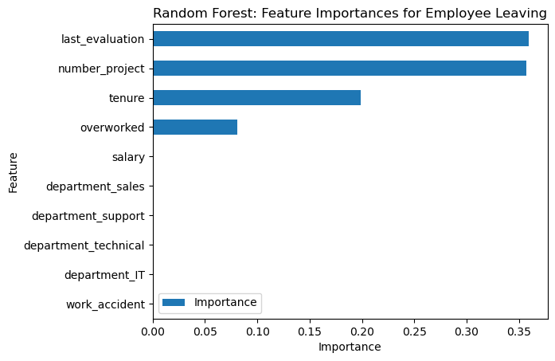

# Salifort

## Overview
In this activity, our primary objective is to harness the power of Python for model building and data analysis to address a critical business challenge faced by Salifort Motors. We will deploy various models to analyze a dataset and generate valuable business insights for our stakeholders. The primary focus of our analysis is to predict employee turnover and understand the underlying factors contributing to it. Our analysis will serve as a foundation for developing strategies that can enhance employee retention, job satisfaction, and ultimately reduce the financial burden associated with high employee turnover.

## Business Understanding
- Company Background:
    Salifort Motors is currently grappling with a significant issue – a high rate of employee turnover. Employee turnover, in this context, encompasses both employees who voluntarily leave their positions and those who are involuntarily separated from the company. This issue has raised concerns within Salifort's senior leadership team due to its far-reaching implications. Salifort is committed to fostering a corporate culture that nurtures employee success and professional development. Moreover, the high turnover rate poses financial challenges as the company invests substantially in recruitment, training, and upskilling of its employees.

- The Challenge:
    Salifort Motors recognizes that predicting employee departures and understanding the underlying reasons are key to mitigating this problem. By gaining insights into the factors driving turnover, the company aims to develop effective solutions. As a first step, the leadership team has tasked the Human Resources department with conducting a survey of a sample of employees to gather information about what might be contributing to the high turnover rate.

- Our Role:
    Next, the leadership team has turned to our expertise in data analysis. They have requested that we analyze the survey data and devise strategies to enhance employee retention. To achieve this, they suggest building a predictive model capable of determining whether an employee is likely to leave the company. This model should consider various data points, including job title, department, number of projects, average monthly hours worked, and any other pertinent factors. An effective predictive model will enable Salifort Motors to not only increase employee retention and job satisfaction but also save substantial resources, both in terms of time and money, which are otherwise spent on recruiting and training new employees.

- Our Approach:
    As specialists in data analysis, we have the liberty to choose the most effective approach for building the predictive model. We can opt for a statistical model like logistic regression, or we can explore the realm of machine learning models, such as decision trees, random forests, and XGBoost. Additionally, we can even consider deploying a combination of statistical and machine learning models to tackle this complex challenge.

- Our Responsibilities:
    Regardless of the approach chosen, our responsibilities encompass the following key tasks:
    Analyzing the key factors influencing employee turnover.
    Developing an effective predictive model.
    Providing recommendations to the leadership team for their next steps based on our analysis.
    Our analysis and model building endeavors will play a pivotal role in guiding Salifort Motors toward a more sustainable and successful future by addressing the critical issue of employee turnover.

## Data Understanding
In this section, we will provide an overview of the dataset "HR_capstone_dataset.csv," which is the foundation of our project. This dataset contains self-reported information from employees of a multinational vehicle manufacturing corporation. It consists of 14,999 rows, with each row representing a different employee's self-reported information. Below, we describe the columns and their characteristics:

### satisfaction_level (int64):
 - Description: This column represents the employee's self-reported satisfaction level, ranging from 0 to 1.
 - Data Type: Integer (0-1)

### last_evaluation (int64):
 - Description: This column contains scores from the employee's last performance review, ranging from 0 to 1.
 - Data Type: Integer (0-1)

### number_project (int64):
 - Description: Indicates the number of projects that the employee has contributed to.
 - Data Type: Integer

### average_monthly_hours (int64):
 - Description: Represents the average number of hours the employee worked per month.
 - Data Type: Integer

### time_spend_company (int64):
 - Description: Reflects how long the employee has been with the company in years.
 - Data Type: Integer

### work_accident (int64):
 - Description: Indicates whether or not the employee has experienced an accident while at work.
 - Data Type: Integer (0 for no accident, 1 for an accident)

### left (int64):
 - Description: Denotes whether or not the employee has left the company.
 - Data Type: Integer (0 for not left, 1 for left)

### promotion_last_5years (int64):
 - Description: Indicates whether or not the employee was promoted in the last 5 years.
 - Data Type: Integer (0 for no promotion, 1 for promotion)

### department (str):
 - Description: Represents the employee's department within the company.
 - Data Type: String

### salary (str):
 - Description: Reflects the employee's salary level, categorized as low, medium, or high.
 - Data Type: String

## Modeling and Evaluation
So What’s likely to make the employee leave the company?
The models and the feature importances extracted from the models confirm that employees at the company are overworked. 

Since the variable we are seeking to predict is categorical, We could build either a logistic regression or a tree-based machine learning model.
The random forest model slightly outperforms the decision tree model.

- Decision Tree: Feature Importances for Employee Leaving :

 Barplot above shows the most relevant variables: ‘last_evaluation’, ‘number_project’,  ‘tenure’ and ‘overworked’.

- Random Forest: Feature Importances for Employee Leaving :

 In the random forest model above, `last_evaluation`, `tenure`, `number_project`, `overworked`, `salary_low`, and `work_accident` have the highest importance. These variables are most helpful in predicting the outcome variable, `left`.

- **Logistic Regression**

The logistic regression model achieved precision of 80%, recall of 83%, f1-score of 80% (all weighted averages), and accuracy of 83%, on the test set.

- **Tree-based Machine Learning**

After conducting feature engineering, the decision tree model achieved AUC of 93.8%, precision of 87.0%, recall of 90.4%, f1-score of 88.7%, and accuracy of 96.2%, on the test set. The random forest modestly outperformed the decision tree model. 

## Conclusion
In conclusion, the analysis and modeling efforts undertaken in this project have provided valuable insights into the challenge faced by Salifort Motors regarding employee turnover. We have successfully employed Python for model building and data analysis to address this critical business issue.

Salifort Motors is concerned about the high rate of employee turnover, which is not only detrimental to the company's culture but also poses financial burdens. Our analysis has centered around predicting employee departures and understanding the driving factors behind them.

We explored various approaches, including logistic regression and tree-based machine learning models such as decision trees and random forests. Among these, the random forest model demonstrated the best performance, achieving an AUC of 93.8%, precision of 87.0%, recall of 90.4%, f1-score of 88.7%, and an accuracy of 96.2% on the test set. This model identified key factors contributing to employee turnover, including last evaluation, tenure, number of projects, overwork, salary level, and work accidents.

Our analysis and model building efforts provide Salifort Motors with a solid foundation to address the employee turnover issue. The insights gained from this project can guide the company's strategies to enhance employee retention, job satisfaction, and ultimately reduce the associated financial costs. By leveraging the power of data analysis and predictive modeling, Salifort Motors is better equipped to create a corporate culture that supports employee success and professional development while achieving significant cost savings.

To retain employees, the following recommendations could be presented:

* Cap the number of projects that employees can work on.
* Consider promoting employees who have been with the company for atleast four years, or conduct further investigation about why four-year tenured employees are so dissatisfied. 
* Either reward employees for working longer hours, or don't require them to do so. 
* If employees aren't familiar with the company's overtime pay policies, inform them about this. If the expectations around workload and time off aren't explicit, make them clear. 
* Hold company-wide and within-team discussions to understand and address the company work culture, across the board and in specific contexts. 
* High evaluation scores should not be reserved for employees who work 200+ hours per month. Consider a proportionate scale for rewarding employees who contribute more/put in more effort. 